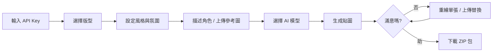

<div align="center">

</div>

# Lu Lu Sticker Tools v3 🎨

一個專業的 LINE 貼圖生成與切片工具，採用客戶端 AI 技術，完全保護您的隱私。

[](https://vercel.com/new/clone?repository-url=https://github.com/CHW1982/lu-lu-sticker-tools_v3)
[](https://chw1982.github.io/lu-lu-sticker-tools_v3/)

## 🌐 線上體驗

- **Vercel 部署**：[https://lu-lu-sticker-tools-v3.vercel.app](https://lu-lu-sticker-tools-v3.vercel.app) *(推薦)*
- **GitHub Pages**：[https://chw1982.github.io/lu-lu-sticker-tools_v3/](https://chw1982.github.io/lu-lu-sticker-tools_v3/)
- **AI Studio**：[在 Google AI Studio 查看](https://ai.studio/apps/drive/1pXqKreYLaVF34nfHwsIPXN1na5wj-Bbp)

## ✨ 核心特色

### 🤖 AI 驅動生成

- **雙模型支援**：Gemini 2.5 Flash (快速) 或 Gemini 1.5 Pro (高品質)
- **智能提示詞**：自動優化角色描述，生成更精準的貼圖
- **參考圖上傳**：支援上傳角色參考圖，AI 更懂你的需求

### 📐 專業版型系統

- **8 格版型** (4×2)：適合精簡表情包
- **16 格版型** (4×4)：最受歡迎的標準尺寸
- **24 格版型** (4×6)：豐富角色情緒展現

### 🎨 豐富風格選項

- **經典 Q 版**：可愛圓潤，LINE 貼圖經典風格
- **像素藝術**：復古遊戲風，極具辨識度
- **水彩手繪**：溫柔細膩，充滿手作感
- **賽璐璐動畫**：日系動畫風格，線條分明
- **3D 渲染**：立體質感，現代時尚

### 🎭 情緒氛圍預設

| 氛圍 | 適用場景 | 情緒關鍵詞 |
|------|---------|-----------|
| 🌟 元氣滿滿 | 日常打招呼 | 開心、活潑、充滿能量 |
| 😴 厭世慵懶 | 週一症候群 | 累癱、無力、不想上班 |
| 🎭 戲劇張力 | 強烈情緒 | 驚訝、崩潰、誇張 |
| 💝 溫馨治癒 | 關心朋友 | 溫暖、療癒、柔軟 |
| 😈 搞怪嘲諷 | 調皮互動 | 賤萌、吐槽、諷刺 |

### ✂️ 專業後期處理

- **智能切片**：自動切割為 370×320px LINE 標準尺寸
- **綠幕去背**：一鍵移除綠色背景（色度範圍可調）
- **單張重繪**：不滿意？獨立重新生成任一貼圖
- **手動替換**：支援上傳自訂圖片替換特定格子
- **批次下載**：打包 ZIP 包含 main.png、tab.png 及所有切片

## 🔐 隱私保護設計

此專案採用**完全客戶端架構**，確保您的資料安全：

✅ **零伺服器模式** - 所有計算都在您的瀏覽器完成  
✅ **本地儲存 API Key** - 使用 LocalStorage，僅存於您的裝置  
✅ **自動過期機制** - API Key 預設 30 天後自動清除  
✅ **自管理配額** - 每位使用者使用自己的 Gemini API 免費配額  
✅ **無資料上傳** - 圖片處理皆使用 Canvas API 本地完成

> 💡 **技術說明**：應用程式直接從瀏覽器呼叫 Google Gemini API，不經過任何中介伺服器。

## 🚀 快速開始

### 方法一：線上使用（無需安裝）

1. 訪問 [Vercel 部署](https://lu-lu-sticker-tools-v3.vercel.app)
2. 首次使用時，系統會提示輸入 API Key
3. 前往 [Google AI Studio](https://aistudio.google.com/app/apikey) 取得免費 API Key
4. 輸入 Key 並選擇記憶天數（建議 30 天）
5. 開始創作！

### 方法二：本地開發

**前置需求**：Node.js 18+

```bash
# 1. 克隆專案
git clone https://github.com/CHW1982/lu-lu-sticker-tools_v3.git
cd lu-lu-sticker-tools_v3

# 2. 安裝依賴
npm install

# 3. 啟動開發伺服器
npm run dev

# 4. 在瀏覽器開啟
open http://localhost:3000
```

### 取得 Gemini API Key

1. 訪問 [Google AI Studio API Key 頁面](https://aistudio.google.com/app/apikey)
2. 使用 Google 帳號登入
3. 點擊 **「Create API Key」**
4. 選擇或建立 Google Cloud 專案
5. 複製產生的 API Key
6. 在應用程式中輸入並儲存

### 免費配額說明

| 模型 | 每日免費額度 | 每分鐘請求限制 | 適用場景 |
|------|-------------|--------------|---------|
| **Gemini 2.5 Flash** | 1,500 次 | 2 次圖像生成 | 快速實驗、大量測試 |
| **Gemini 1.5 Pro** | 50 次 | 2 次圖像生成 | 高品質成品 |

> 💡 **使用建議**：  
>
> - 開發測試階段使用 Flash 模型（快速且配額充足）  
> - 最終成品生成使用 Pro 模型（畫質更佳）  
> - 個人使用完全免費，無需信用卡

## 📦 部署指南

### 🌟 選項 1: Vercel 部署（推薦）

**最快方法 - 一鍵部署**

[](https://vercel.com/new/clone?repository-url=https://github.com/CHW1982/lu-lu-sticker-tools_v3)

**使用 CLI 部署**

```bash
# 1. 安裝 Vercel CLI（全域）
npm install -g vercel

# 2. 登入 Vercel 帳號
vercel login

# 3. 部署到生產環境
vercel --prod
```

**優勢**：

- ✅ 自動 HTTPS
- ✅ 全球 CDN 加速
- ✅ 自動偵測 Vite 框架
- ✅ 每次推送自動重新部署

---

### 🌐 選項 2: GitHub Pages 部署

**自動部署（推薦）**

1. 推送程式碼到 GitHub Repository
2. GitHub Actions 會自動執行建置（參考 `.github/workflows/deploy.yml`）
3. 前往 **Settings** → **Pages**
4. Source 選擇 `gh-pages` 分支
5. 訪問 `https://<username>.github.io/<repo-name>/`

**手動部署**

```bash
# 1. 建置專案（啟用 GitHub Pages 模式）
GITHUB_PAGES=true npm run build

# 2. 部署到 gh-pages 分支
npx gh-pages -d dist
```

> ⚠️ **重要**：GitHub Pages 需要設定 `base` 路徑，已在 `vite.config.ts` 中配置。

---

### 🔷 選項 3: Netlify 部署

```bash
# 1. 建置專案
npm run build

# 2. 安裝 Netlify CLI
npm install -g netlify-cli

# 3. 登入 Netlify
netlify login

# 4. 部署到生產環境
netlify deploy --prod --dir=dist
```

或使用 **拖放部署**：

1. 前往 [Netlify Drop](https://app.netlify.com/drop)
2. 將 `dist` 資料夾拖放至頁面
3. 立即取得部署 URL

---

## 🛠️ 技術架構

### 前端技術棧

```
├── React 19.2           # 前端框架（使用最新 Compiler）
├── TypeScript 5.8       # 類型安全
├── Vite 6.2             # 極速建置工具
├── TailwindCSS          # 實用優先 CSS 框架
└── @google/genai 1.33   # Google Gemini SDK
```

### 核心依賴

| 套件 | 用途 | 版本 |
|------|------|------|
| `@google/genai` | Gemini API 客戶端 | 1.33.0 |
| `jszip` | ZIP 打包功能 | 3.10.1 |
| `react` | UI 渲染 | 19.2.1 |
| `vite` | 開發與建置 | 6.2.0 |

### 專案結構

```
lu-lu-sticker-tools_v3/
├── components/           # React 元件
│   ├── ApiKeyModal.tsx   # API Key 輸入視窗
│   ├── Header.tsx        # 頁首元件
│   ├── SettingsPanel.tsx # 設定面板（版型、風格、氛圍）
│   └── ResultsView.tsx   # 結果展示與編輯
├── services/
│   └── geminiService.ts  # Gemini API 整合
├── utils/
│   └── imageProcessor.ts # 圖片切片與處理
├── types.ts              # TypeScript 型別定義
├── App.tsx               # 主應用程式
├── index.tsx             # 應用程式入口
├── vite.config.ts        # Vite 設定
└── vercel.json           # Vercel 部署配置
```

## 📝 使用流程

### 基本工作流程



### 詳細步驟

1. **初次設定**
   - 開啟應用程式
   - 在彈出視窗輸入 Gemini API Key
   - 選擇記憶天數（1-30 天）

2. **基本設定**
   - 選擇版型：8/16/24 格
   - 選擇畫風：Q版/像素/水彩/動畫/3D
   - 選擇氛圍：元氣/厭世/戲劇/治癒/搞怪

3. **角色描述**
   - 輸入詳細的角色特徵（例：「白色小貓，藍色大眼睛，戴著紅色圍巾」）
   - 或上傳參考圖片（支援 JPG/PNG，建議 < 2MB）

4. **生成與調整**
   - 點擊「開始生成 LINE 貼圖」
   - 等待 AI 生成（通常 30-60 秒）
   - 針對不滿意的單張點擊「重新生成」
   - 或上傳自訂圖片替換

5. **匯出成品**
   - 可選「移除綠色背景」
   - 點擊「下載完整 ZIP」
   - 包含內容：
     - `main.png` - 主圖 (240×240)
     - `tab.png` - 標籤圖 (96×74)
     - `sticker_01.png ~ sticker_XX.png` - 所有切片 (370×320)

## 🎯 使用技巧

### 獲得最佳效果

✅ **角色描述最佳實踐**

```
好的範例：
「圓滾滾的白色小貓，藍寶石般的大眼睛，粉紅色小鼻子，脖子上戴著鈴鐺項圈」

避免過於簡單：
「一隻貓」
```

✅ **氛圍與風格搭配建議**

- 元氣滿滿 + Q版風格 = 可愛活潑
- 厭世慵懶 + 像素風 = 賤萌復古
- 戲劇張力 + 動畫風 = 日系誇張
- 溫馨治癒 + 水彩風 = 柔和溫暖
- 搞怪嘲諷 + 3D風格 = 現代幽默

✅ **模型選擇建議**

- **開發測試** → Gemini 2.5 Flash（快速、配額大）
- **最終成品** → Gemini 1.5 Pro（高品質）

### 常見問題排解

**Q: API Key 儲存在哪裡？安全嗎？**  
A: 儲存在瀏覽器的 LocalStorage，僅存於您的裝置，不會上傳到任何伺服器。設定自動過期時間後會自動清除。

**Q: 為什麼生成失敗？**  
A: 可能原因：

1. API Key 無效或過期
2. 超過每日免費配額
3. 網路連線問題
4. 角色描述包含不當內容（違反 Google AI 政策）

**Q: 可以商業使用嗎？**  
A: 工具本身可自由使用，但 AI 生成的圖片需遵守 [Google Gemini 使用條款](https://ai.google.dev/gemini-api/terms)。建議商業用途前諮詢法律顧問。

**Q: 生成的貼圖尺寸正確嗎？**  
A: 是！自動切片為 370×320px，完全符合 [LINE Creators Market 規範](https://creator.line.me/zh-hant/guideline/sticker/)。

## 🤝 貢獻指南

歡迎貢獻！無論是回報 Bug、建議新功能，或提交 Pull Request。

### 開發環境設定

```bash
# 1. Fork 此專案
# 2. 克隆您的 Fork
git clone https://github.com/YOUR_USERNAME/lu-lu-sticker-tools_v3.git

# 3. 建立功能分支
git checkout -b feature/amazing-feature

# 4. 提交變更
git commit -m 'Add some amazing feature'

# 5. 推送到分支
git push origin feature/amazing-feature

# 6. 開啟 Pull Request
```

### 程式碼風格

- 使用 TypeScript
- 遵循 React 19 最佳實踐
- 保持元件單一職責
- 函式命名使用 camelCase
- 元件命名使用 PascalCase

## 📄 授權與版權

**版權所有** © 2025 Lu Lu Sticker Tools  
**開發者**：[@CHW1982](https://github.com/CHW1982)

本專案為開源軟體，使用 MIT 授權。詳見 [LICENSE](LICENSE)。

> ⚠️ **重要提醒**：AI 生成的圖片版權歸屬請參考 [Google Gemini API 服務條款](https://ai.google.dev/gemini-api/terms)。

## 🙏 致謝與靈感

- **靈感來源**：[Line Cutter](https://miner.tw/line_cutter/) by Miner
- **AI 技術**：[Google Gemini API](https://ai.google.dev/)
- **圖示來源**：Emoji 來自 Unicode 標準
- **社群支持**：感謝所有使用者的回饋與建議

## 📞 聯絡與支援

- **GitHub Issues**：[回報問題](https://github.com/CHW1982/lu-lu-sticker-tools_v3/issues)
- **功能建議**：[提交想法](https://github.com/CHW1982/lu-lu-sticker-tools_v3/discussions)
- **Email**：<carlsonslove@gmail.com>

---

<div align="center">

**如果這個專案對您有幫助，請給個 ⭐️ Star！**

Made with ❤️ and ☕️ by @CHW1982

</div>
